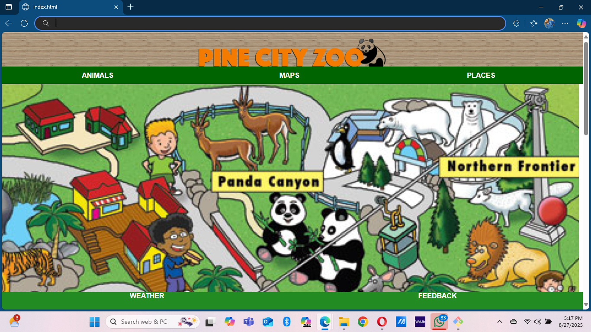
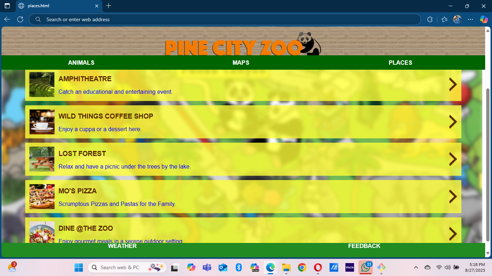
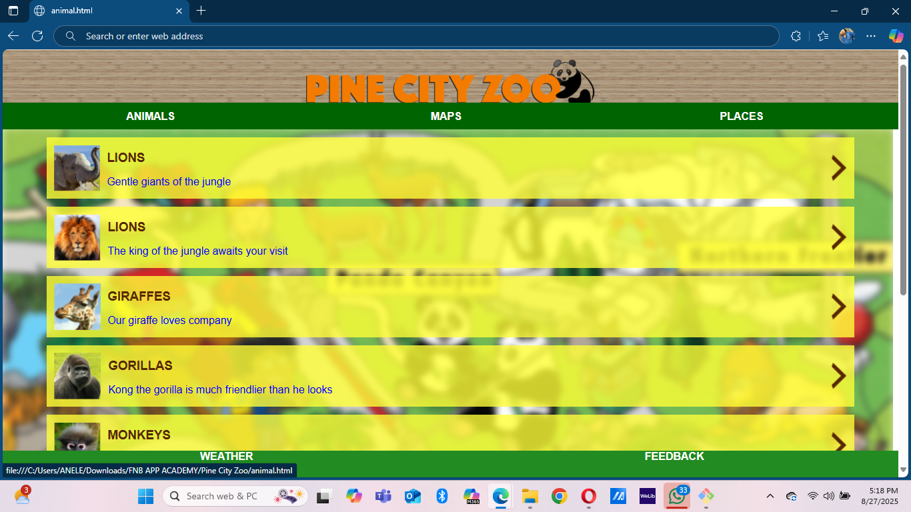
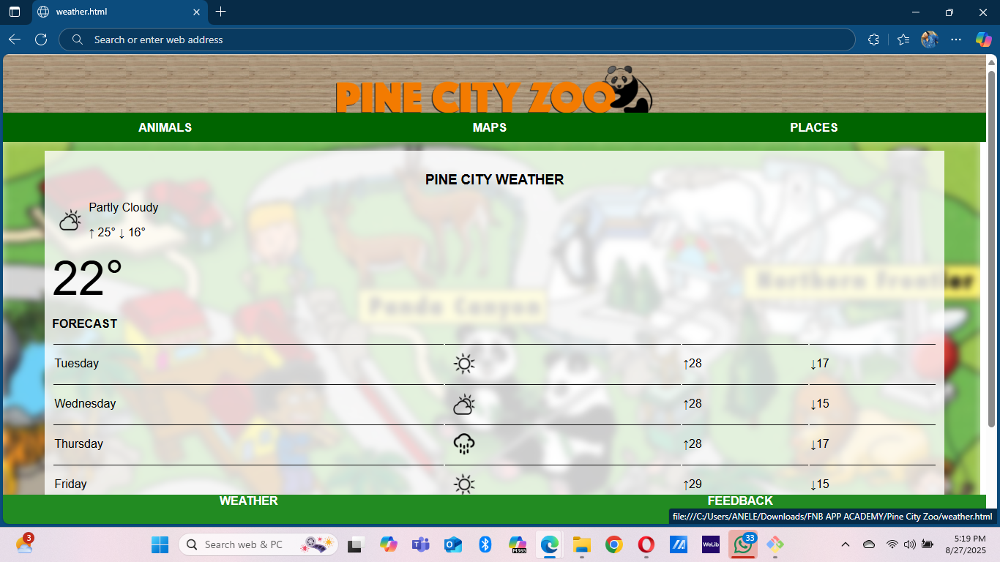
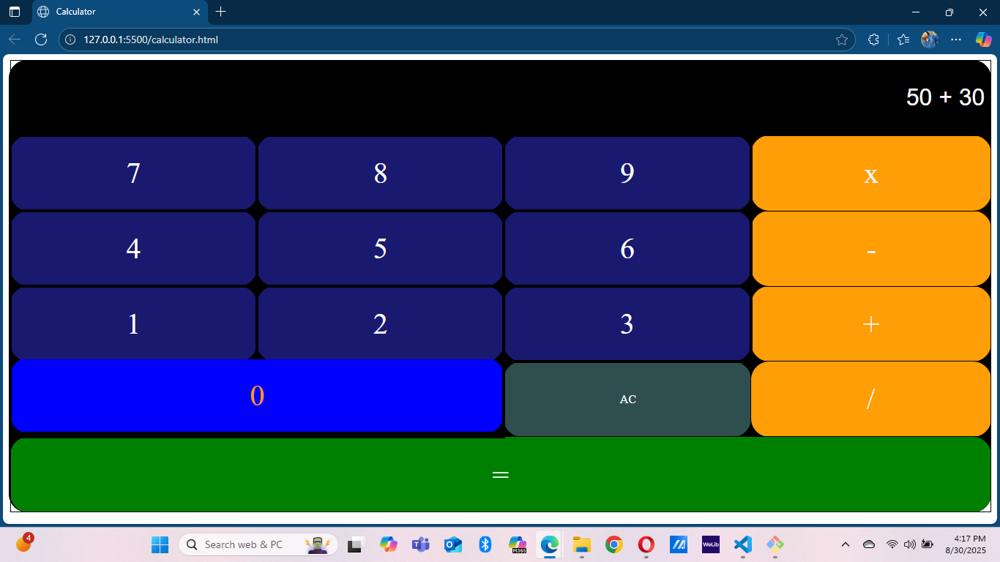

# FNB Academy Projects 🦁🖩

Here you will find projects that i developed during the **FNB Academy Program**.  
they showcases web applications built with HTML, CSS, and JavaScript.

The projects included are:

- **Pine City Zoo**: A comprehensive zoo management system designed to streamline the management of animals, enclosures, and visitors, while providing an interactive user experience.
- **Calculator**: A simple web-based calculator that performs basic arithmetic operations.

---

## ✨ Features

### Pine City Zoo 🦁🐘🐒
- 🐾 Manage animal records (species, age, habitat)
- 🏞️ Enclosure information and maintenance
- 🎟️ Ticketing and visitor management

### Calculator 🖩
- ➕ Addition
- ➖ Subtraction
- ✖️ Multiplication
- ➗ Division
- 🔄 Clear/reset function

---

## 🛠️ Technologies Used
- HTML
- CSS
- JavaScript

---

## 🚀 How to Run
1. Clone this repository:
   ```bash
   git clone https://github.com/Simangaliso24/Pine-City-Zoo.git

## 👨🏽‍💻 Author
Developed by **Simangaliso Sangweni** during the FNB Academy program.

## 🌐 Live Demo 
<p align="center">
  <a href="https://simangaliso24.github.io/Pine-City-Zoo/" target="_blank">
    
  </a>
</p>


## 📸 Screenshots
Below are screenshots showing how the website looks.

## 📸 Screenshots

| Homepage | Places | Animals Page |
|-------|------------|--------------|
|  |  |  |

| Weather | Feedback |
|---------|-----------|
|  |  |


---

## 2️⃣ Calculator 🖩

This is a simple web-based calculator that performs basic arithmetic operations. 

### 🌐 Live Demo  
<p align="center">
  <a href="https://simangaliso24.github.io/Pine-City-Zoo/Calculator/calculator.html" target="_blank">
    
  </a>
</p>

### 📸 Screenshot


