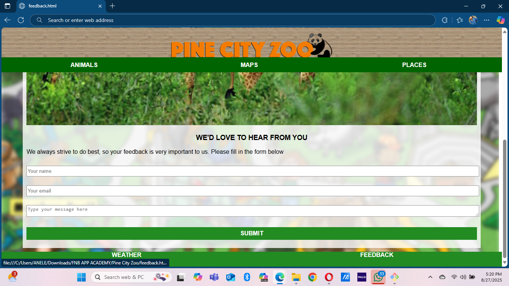

# PineCity Zoo 🦁🐘🐒

The **PineCity Zoo** project was developed during the **FNB Academy program**.  
It is a zoo management system designed to help manage animals, enclosures, and visitors while providing an interactive experience.

## ✨ Features
- 🐾 Manage animal records (species, age, habitat)
- 🏞️ Enclosure information and maintenance
- 🎟️ Ticketing and visitor management

## 🛠️ Technologies Used
- HTML
- CSS
- JavaScript

## 🚀 How to Run
1. Clone this repository:
   ```bash
   git clone https://github.com/Simangaliso24/pinecity-zoo.git
   ```

## 👨🏽‍💻 Author
Developed by Simangaliso Sangweni during the FNB Academy program.

## 📸 Screenshots

### Homepage


### Animals Page


### Places Page


### Weather Page


### Feedback Page

